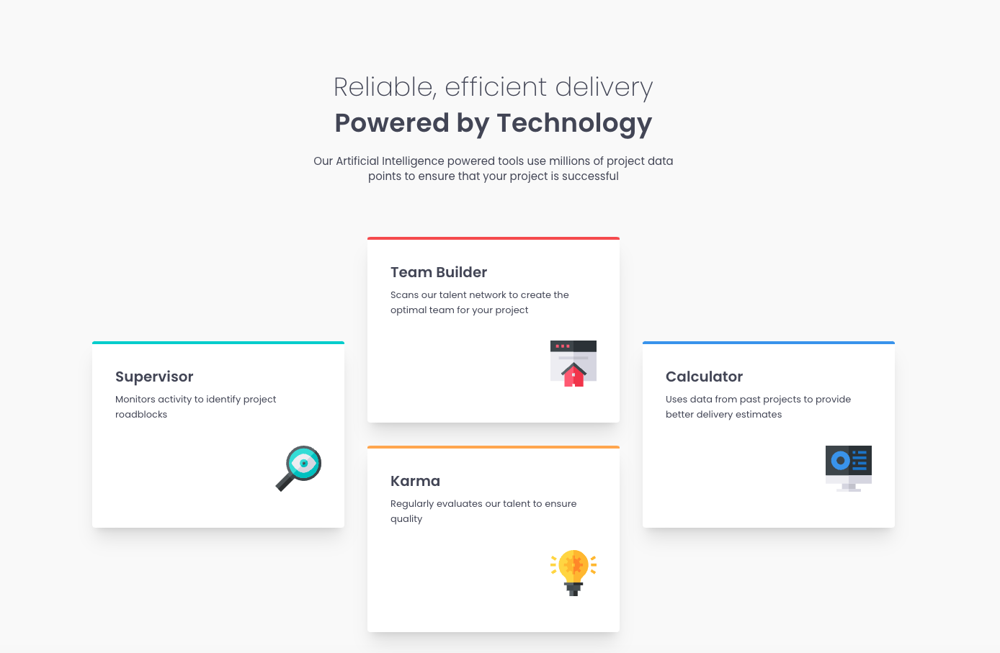

# Frontend Mentor - Four card feature section solution

This is a solution to the [Four card feature section challenge on Frontend Mentor](https://www.frontendmentor.io/challenges/four-card-feature-section-weK1eFYK). Frontend Mentor challenges help you improve your coding skills by building realistic projects.

## Table of contents

- [Frontend Mentor - Four card feature section solution](#frontend-mentor---four-card-feature-section-solution)
  - [Table of contents](#table-of-contents)
  - [Overview](#overview)
    - [The challenge](#the-challenge)
    - [Screenshot](#screenshot)
    - [Links](#links)
  - [My process](#my-process)
    - [Tech Stack](#tech-stack)
    - [What I learned](#what-i-learned)
    - [Continued development](#continued-development)
    - [Useful resources](#useful-resources)
  - [Author](#author)

## Overview

### The challenge

Users should be able to:

- View the optimal layout for the site depending on their device's screen size

### Screenshot



### Links

- Solution URL: [Frontend Mentor Solution](https://www.frontendmentor.io/solutions/four-card-feature-section-using-tailwindcss-nextjs-Atm6rLHnx7)
- Live Site URL: [Deployed on Vercel](https://fm-four-card-feature-section-seven.vercel.app/)

## My process

### Tech Stack

[](https://skillicons.dev)

- [Next.js](https://nextjs.org/) - React framework
- [React](https://reactjs.org/) - JS library
- [tailwindcss](https://tailwindcss.com/) - utility-first CSS framework
- [node.js](https://nodejs.org/ja) - Runtime & Build Tools

### What I learned

- [Conquering Responsive Layouts](https://courses.kevinpowell.co/view/courses/conquering-responsive-layouts)
- [Learn Responsive Design](https://web.dev/learn/design)
- about the CSS `clamp()` function
- about media query of tailwindcss
  ```js
      <div className="mx-auto flex w-full max-w-[316px] flex-col gap-8 md:max-lg:max-w-[1114px] lg:max-w-max lg:flex-row lg:items-center">
      {/* Card1 */}
  ```

### Continued development

- I’d like to deepen my understanding of what I learned in Conquering Responsive Layouts and Learn Responsive Design.
- I want to gain a deeper understanding of why mobile-first design is considered a best practice.

### Useful resources

- [Min-Max-Value Interpolation](https://min-max-calculator.9elements.com/?40,80,377,768) - This helped me for using CSS `calc()` function.

## Author

- Website - [BlonoBuccellati](https://github.com/BlonoBuccellati)
- Frontend Mentor - [@BlonoBuccellati](https://www.frontendmentor.io/profile/BlonoBuccellati)
- zenn - [@bln](https://zenn.dev/bln)
